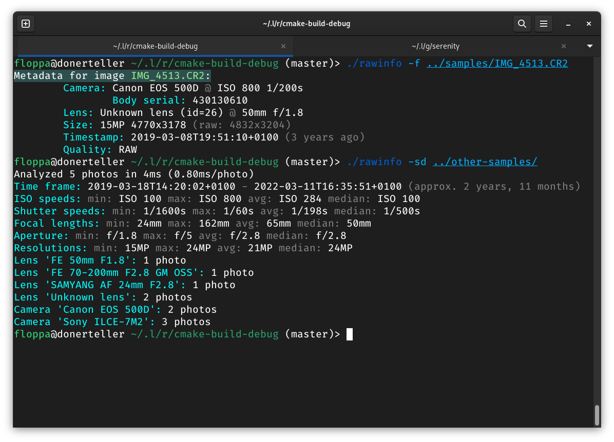

# rawinfo



Scuffed command-line frontend for libraw

## Disclaimer

Only tested on Linux, may or may not work on your Windows machine or Mac.

Right now this program is hard-coded to only look for .ARW (Sony) and .CR2|.CR3 (Canon) files, as those
are the only ones I have easy access to.
Theoretically, [the actual libraw library could handle much more](https://www.libraw.org/supported-cameras),
but that would require me to add a bunch of file extensions that I neither know nor have samples to test.

## Usage

`rawinfo [-s] [-f <files>] [-d <directories>] [options]`

All available options:

- `-s`, `--silent`: Do not show per-file information, useful for avoiding
  unnecessary output when scanning a large number of files

- `-d`, `--directories`: Directories to recursively search for raw files

- `-f`, `--files`: List of raw files to process

- `--showCamera[=true|false]`: Show camera name, image ISO and shutter speed

- `--showLens[=true|false]`: Show lens name, image focal length and aperture

- `--showSize[=true|false]`: Show image size (dimensions) and resolution

- `--showTimestamp[=true|false]`: Show image timestamp

- `--showSoftware[=true|false]`: Show camera software version

- `--showCameraType[=true|false]`: Show camera type

- `--showQuality[=true|false]`: Show image quality setting (e.g. raw compression level)

Boolean options `show{Camera,Lens,Size,Timestamp,Software,CameraType,Quality}` are all true by default.

## Build dependencies

- [CMake](https://cmake.org): Build system for C++

- [libraw](https://libraw.org): The actual backend library

- [libfmt](https://fmt.dev): Formatting strings + making printing stuff in C++ bearable

- [cxxopts](https://github.com/jarro2783/cxxopts): Command-line argument parsing

On Arch Linux, you can easily install these with `# pacman -S cmake libraw fmt cxxopts`.
You will also need a modern C++20 compatible compiler, but I think that goes without saying.

Build this like any other CMake project:

```bash
# If you have not yet done so, install the dependencies before building
git clone https://github.com/pascalpuffke/rawinfo
cd rawinfo
mkdir build
cd build
cmake ..
cmake --build .
```
